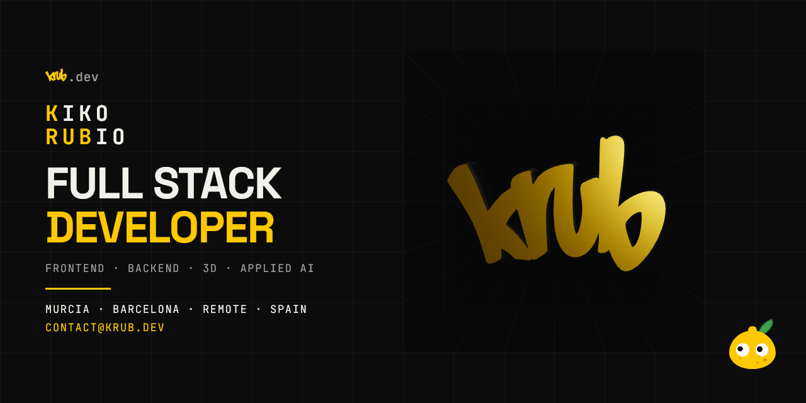

# krub.dev

[](https://github.com/krub-dev/portfolio-krub/actions/workflows/ci.yml)
[](https://vuejs.org)
[](https://vite.dev)
[](https://threejs.org)
[](https://tresjs.org)
[](https://vitest.dev)
[](https://playwright.dev)
[](https://vercel.com)

[](https://krub.dev)

Live at **[krub.dev](https://krub.dev)**. My personal portfolio: one page plus a 404, bilingual
(English / Spanish), dark and light themes with five accent palettes, built with Vue 3 and Vite.

Kiko Rubio, full stack developer in Murcia.

## How it is made

Spec first, and that is how it started. The contract comes first, the code follows, and any trade-off
is logged rather than hidden.

The tests take the same stance: unit coverage and a Playwright suite across Chromium and WebKit run in
CI on every push. Still, the final pass is always manual. A machine cannot judge whether an easing
curve feels right, a hover communicates clearly, or a 3D scene responds naturally.

I use AI tooling to accelerate the work, but never to delegate the thinking. I design the system,
review every diff, and answer for what ships.

## Stack

- **Vue 3** with `<script setup>`. Plain JavaScript, no TypeScript.
- **Vite** for the dev server and the build.
- **vue-router** — three routes: `/`, `/privacy` and a catch-all 404. There are also three dev-only screens,
  `/design-system` (the tokens and the components sheet), `/logo-lab` (the hero stage: the entrance,
  the fog modes, and the mark, the ring and the halo switched on and off) and `/og` (the Open Graph
  card, the LinkedIn cover and the README banner), lazy-loaded and kept out of the production bundle.
- **vue-i18n** — nested dictionaries, English by default.
- **TresJS / Three.js** for the hero's 3D mark. I come from a 3D background, and TresJS is where it
  met Vue: the same declarative components as the rest of the page describe the scene, the renderer
  owns its own loop and stops when the stage leaves the screen, and the chunk is lazy, never even
  imported below 900px. [tresjs.org](https://tresjs.org) · [repo](https://github.com/Tresjs/tres)
- **Vitest** and **Playwright** for tests.
- No CSS framework and no preprocessor. Design tokens are CSS custom properties in one global
  stylesheet; everything else is `<style scoped>`.

## Running it

```bash
npm install
npm run dev
```

| | |
|---|---|
| `npm run dev` | dev server, hot reload |
| `npm run build` | production bundle into `dist/` |
| `npm run preview` | serve that bundle locally |
| `npm run test` | unit tests (Vitest) |
| `npm run test:watch` | the same, in watch mode |
| `npm run test:e2e` | end-to-end tests (Playwright: Chromium and WebKit) |

One more script under `scripts/` is maintenance rather than part of the flow: the image optimiser the
Performance section mentions. It carries its own dependency (ffmpeg); install it once with
`npm --prefix scripts install`.

The CV is not built from this repository. Its sources and generator live in a sibling `cv/` folder,
and the compiled PDFs are copied by hand into `public/uploads/`.

## Performance

Measured against the deployment with PageSpeed Insights: **95 mobile / 100 desktop**, with
accessibility, best practices and SEO at 100 across the board. Getting there was mostly about weight,
and four things did it:

- **The 3D waits for the shutter.** The hero's mark sits behind a metal blind that starts closed, so
  the ~885 KB TresJS/Three chunk and the WebGL start-up are not paid on load. They are imported on the
  first reveal and not before. This alone took the desktop Total Blocking Time from ~450 ms to ~10 ms.
- **Turnstile loads on view.** The captcha on the contact form is a 694 KB third-party script that
  used to load with the page. An `IntersectionObserver` now pulls it in as the form approaches.
- **The card images are optimised.** They shipped at full capture size; `scripts/optimize-images.mjs`
  re-encodes them to 1600px at a sane quality (the four covers alone went from 1.4 MB to 0.54 MB).
- **The fonts are self-hosted.** Two `.woff2` files in `public/`, no Google Fonts stylesheet blocking
  the first paint.

See decision 103 and the backlog's Performance section for the detail.

## Tests

Forty-four unit tests and around seventy end-to-end flows, run on a desktop, two phones and a
tablet (Chromium and WebKit).

Vitest covers the pure functions — how a timeline period is formatted, how the carousel index wraps,
how a URL is tidied — the contact validation and its endpoint, and the composables that touch storage:
theme, language and accent survive a reload, reject junk values and cope with `localStorage` throwing.

Playwright exists for a narrower reason. Scroll events, animation frames and CSS transitions cannot be
verified by reading the DOM — you need a browser that actually paints. So it covers the chrome (the
navbar compacting, the footer sliding in, the scroll spy), the projects rail paging and dragging, the
testimonials pager, the stack lighting up and Limonacho naming a tile, the contact form validating and
sending, the 404 fitting one viewport, and the custom cursor. It runs against the production build.

It earned its keep on the first run by finding a real bug: the footer was measured with the content box
instead of the border box, so the page reserved 18px too little and the fixed footer sat on top of the
end of the contact section.

The same suite can be pointed at a deployment instead of the local build, which is how a release gets
checked before a domain is moved onto it:

```bash
E2E_BASE_URL=https://example.vercel.app npx playwright test              # bash
$env:E2E_BASE_URL='https://example.vercel.app'; npx playwright test      # PowerShell
```

One limit worth stating: the hero's 3D scene is gated under `navigator.webdriver`, so no project in
the suite opens WebGL. The shutter, the logo drag and the cursor gesture are verified by hand in a
real browser, not here.

## Layout

```
public/            served as-is: logo, photo, og banner, stack icons, self-hosted fonts
                   (with their OFL licences), the acho clip, the CV PDFs, favicon,
                   apple touch icon, robots, sitemap, llms.txt
api/               the contact handler, the same one Vercel runs
docs/              the spec, the component contracts, the roadmap, the decision log, the backlog
scripts/           dev tooling: the image optimiser
tests/
├─ unit/           Vitest
└─ e2e/            Playwright
src/
├─ components/
│  ├─ base/        stateless and reusable (BaseButton, SectionHeading, TechIcon…)
│  ├─ chrome/      fixed UI that owns behaviour (navbar, footer, cursor, background grid)
│  ├─ content/     project card and modal, carousel, spec list, testimonials
│  └─ sections/    one component per page section, plus the hero's logo stage and marquee
├─ composables/    shared logic, no markup (theme, language, scroll, pointer, focus trap)
├─ data/           every sentence and every project — start at src/data/index.js
├─ locales/        en.json / es.json — interface strings only
├─ router/
├─ styles/         tokens.css — the only file allowed to declare a colour
├─ utils/          small pure functions
└─ views/
```

## Rules the whole codebase follows

- **No visible string inside a component.** It comes from a prop, from `src/locales/`, or from
  `src/data/`.
- **No literal colours.** Always `var(--token)`. The documented exceptions are colours that belong to
  a specific element rather than to the theme — the availability dot's green and Limonacho's palette —
  and the design spec names each one.
- **One `requestAnimationFrame`** for everything that follows the mouse: the custom cursor, the
  magnetic hover and the lemon's pupils all subscribe to a single loop. The 3D logo is the one
  exception — Three's renderer owns its own loop, paused while off-screen.
- **Content and interface are separate.** Sentences I wrote live in `src/data/`, with both languages
  side by side in one file. Strings the interface needs live in `src/locales/`.

## Documentation

- [`docs/design-spec.md`](docs/design-spec.md) — the visual contract. Every colour, size, easing curve
  and behaviour, section by section.
- [`docs/components.md`](docs/components.md) — the component tree and the props of each one.
- [`docs/roadmap.md`](docs/roadmap.md) — the build order. Steps 1–12 are the record of what was built,
  kept as it was.
- [`docs/backlog.md`](docs/backlog.md) — what comes after the roadmap: the pending tasks and the ideas
  that are not tasks yet.
- [`docs/decisions.md`](docs/decisions.md) — every choice that is not obvious from reading the code,
  and the reasoning behind it. Including the ones where I went against the original spec, and why.

## Deployment

Vercel, from `main`. The reasoning behind `vercel.json` lives here because JSON has no comments and
Vercel validates the file against a strict schema — an unrecognised key fails the deploy.

Cache headers are split by one question: **does the filename change when the contents do?**

- `/assets/*.js` and `*.css` are fingerprinted by Vite, so a new build produces a new name. Immutable
  for a year, safely.
- `/assets/img/*`, `/icons/*` and `/fonts/*` come straight out of `public/` and keep their names across
  deploys. One day — long enough to be worth caching, short enough that replacing the banner (or a
  font) takes effect the same afternoon rather than in 2027. (Lighthouse flags this as a 366 KB saving;
  the alternative is hashing the filenames, which the `public/` folder can't do.)
- `/` is never cached hard. `index.html` is what points at the current bundle; a stale copy pins a
  visitor to an old build.

The one rewrite sends every unmatched path to `/`, so the SPA's own 404 route renders instead of
Vercel's plain-text page. It deliberately excludes `/assets`, `/icons`, `/fonts`, `/uploads` and
`/api`. Vercel checks the filesystem **before** applying a rewrite, so real static files are served
normally — and a missing one under those prefixes now returns a proper 404 instead of the SPA shell.
That matters because the fingerprinted `/assets/*.js` is cached immutable for a year: without the
exclusion, a stale `index.html` asking for a chunk a later deploy had removed would cache the shell
for a year too. The catch-all answers HTTP 200 with the 404 content — a soft 404 — which is the
trade-off for keeping the site's chrome (grid, cursor, navbar, footer) around the message. A real 404
status would need edge middleware, so the 404 view adds its own `robots: noindex` meta instead: an
unknown URL is not indexed despite the 200.

Plus `nosniff`, `Referrer-Policy` and `X-Frame-Options` on everything.

## Licence

Proprietary, all rights reserved (see [`LICENSE`](LICENSE)): the code is here to be read, not reused
wholesale. The content, the brand, the logo and the photographs are mine and are not reusable at all.
If a particular piece is useful to you, ask me.
